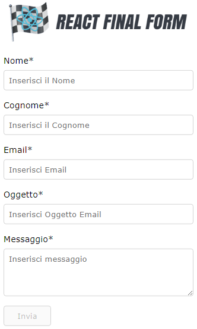

<h1>React Final Form</h1>

<h2>Documentazione per principianti</h2>

<a href="https://pdfhost.io/v/sXBWki37g_React_Final_Form_Documentazione_per_principiantI">PDF documentazione</a>

React Final Form è pensato per essere <b>Modulare</b>, <b>Senza Dependencies</b>, <b>ad Alte Performance</b> e <b>Compatibile con gli Hook.</b>

N.B. I dati del form verranno salvati in LocalStorage

